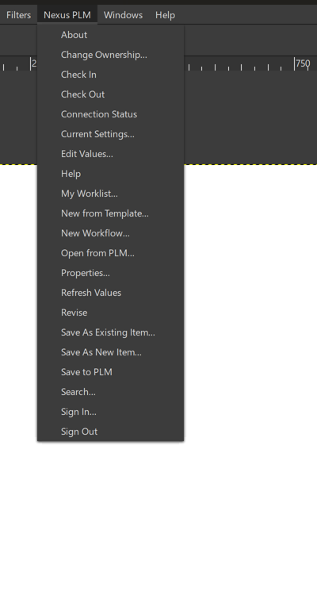
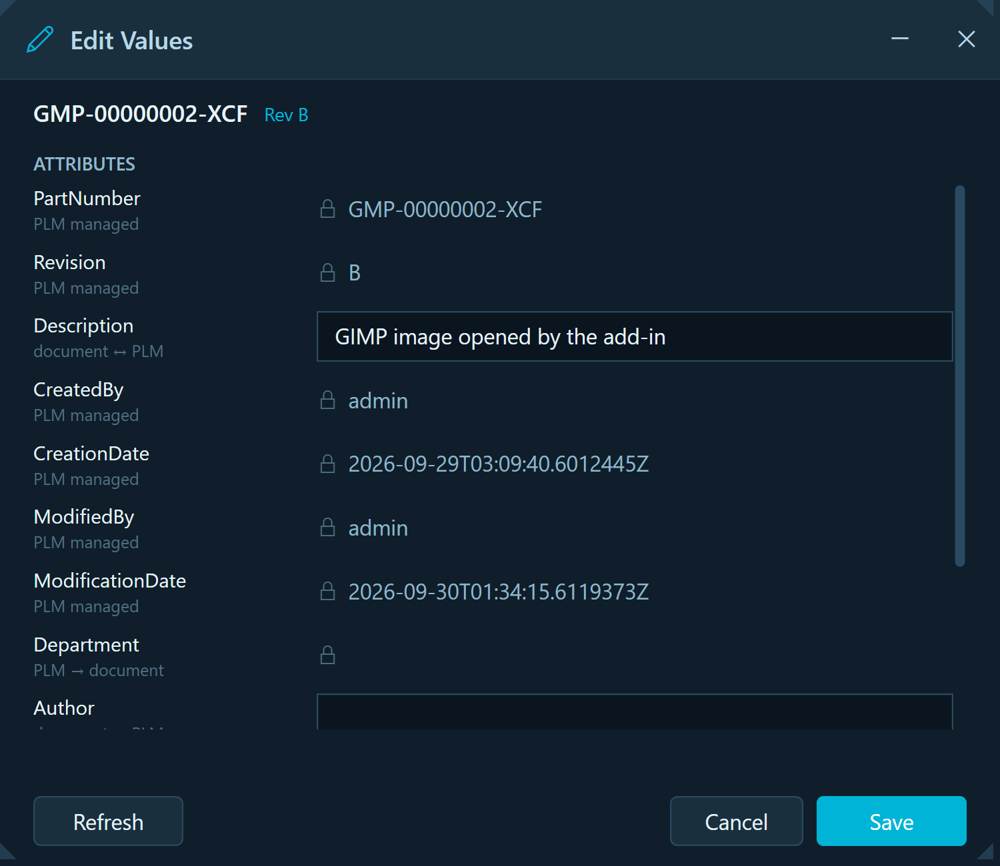

# Nexus PLM for GIMP

[](LICENSE)

Product lifecycle management from inside GIMP. Create an image from a PLM template, check it out,
edit its attributes, check it back in — without leaving GIMP.



The add-in is a Python plug-in with a **Nexus PLM** menu of its own on the menu bar. It talks to
the **Nexus PLM Addin Service** on `localhost:5100`, which owns the dialogs and does the talking
to the PLM server — so the same windows, wording and behaviour appear in GIMP, Inkscape, QGIS,
Word, LibreOffice, OpenOffice and ONLYOFFICE.

Tested against GIMP **3.2.6** (bundled Python 3.14).

- **[User guide](docs/user-guide.md)** — every command, what it does, and where the values go.
- **[Developer guide](docs/developer-guide.md)** — how it is built, how to change it, what GIMP
  does differently and how that shaped the design.

---

## What it does

Twenty-one commands (GIMP sorts the menu alphabetically):

| | |
|---|---|
| **Documents** | New from Template · Open from PLM · Search |
| **Saving** | Save to PLM · Save As New Item · Save As Existing Item |
| **Lifecycle** | Check Out · Check In · Revise · Change Ownership |
| **Workflow** | My Worklist · New Workflow |
| **Values** | Properties · Edit Values · Refresh Values |
| **Session** | Sign In · Sign Out · Current Settings · Connection Status · Help · About |

There is deliberately no Release: a revision reaches Released only by running a workflow, which
New Workflow starts.



## The attributes are in the file

That is the whole point. Every attribute PLM maps for the item is written into the image's own
**parasite** — GIMP's mechanism for arbitrary named data attached to an image — so a `.xcf`
carries its part number, revision and the rest wherever it goes. No sidecar, no database row keyed
on a file name.

Measured on 3.2.6 before a line of this was written: attach a parasite with `PARASITE_PERSISTENT`,
save, reload, and the value comes back byte for byte. **The flag is the whole trick** — without it
a parasite lives only while the image is open and is silently absent from the saved file.

```
parasite "nexus-plm/attributes":
{ "PartNumber": "GMP-00000002-XCF", "Revision": "B",
  "Description": "GIMP image opened by the add-in - edited from GIMP",
  "CreatedBy": "admin", "CreationDate": "2026-09-29T03:09:40Z", ... }
```

An image can *also* show a value, by having a **text layer named after the attribute key**; the
add-in fills those in. Most images will not, and nothing depends on it.

**A parasite does not survive export.** A PNG or JPEG exported from the image carries none of it.
XMP would; it is deliberately not done until somebody needs it.

## How it fits together

```
GIMP  ──►  nexus-plm.py  ──►  nexusplm/commands.py  ──HTTP──►  Addin Service  ──►  Nexus PLM Engine
          (one PlugIn,             │                          (localhost:5100)      Vault, types, workflow
       21 procedures)         nexusplm/xcf.py                        │
                            (the parasite record)          the dialogs a user sees live here,
                                                           shared by every host
```

The plug-in keeps no business rules of its own. It declares what it is (`HOST_NAME`) and what it
can open (`FILE_EXTENSIONS`) with every request — the service needs no code change to gain a host
— writes PLM's values into the image, and asks the service for everything else.

## Installing

Run `NexusPlmGimpAddinSetup.exe` from a [release](../../releases). Per user, no administrator
rights: it copies the plug-in into the plug-ins folder of your newest GIMP profile
(`%APPDATA%\GIMP\3.2\plug-ins\nexus-plm`). Restart GIMP and the **Nexus PLM** menu appears.

You also need the **Nexus PLM tray application** (`Nexus.PLM.WPF.Addins`) running — it hosts the
service the plug-in talks to, and it shows the dialogs.

## Building

```bash
python plug-in/build.py --install    # copy into GIMP's user plug-ins directory; restart GIMP
python -m pytest tests/ -q           # 77 tests; no GIMP needed
"%ProgramFiles(x86)%\Inno Setup 6\ISCC.exe" installer\Nexus.PLM.Gimp.Addin.iss   # the installer
```

## Repository layout

| | |
|---|---|
| `plug-in/nexus-plm/nexus-plm.py` | The `Gimp.PlugIn`: one procedure per menu entry, all dispatching to `commands.run`. |
| `plug-in/nexus-plm/nexusplm/menu.py` | The menu table — no `gi` in it, so tests can read it. |
| `plug-in/nexus-plm/nexusplm/commands.py` | One function per command — the whole surface a user touches. |
| `plug-in/nexus-plm/nexusplm/xcf.py` | The parasite record, named text layers, and a staged file. |
| `plug-in/nexus-plm/nexusplm/host.py` | The parts that know they are inside GIMP. |
| `plug-in/nexus-plm/nexusplm/{client,state,identity,navigator}.py` | Shared with the Inkscape and QGIS add-ins; no GIMP API in any of them. |
| `plug-in/build.py` | Installs into the right profile folder with the right name. |
| `tools/nexus-plm-build-template/` | The plug-in that made `dist/GIMP Image.xcf` — only GIMP writes XCF. |
| `tests/` | pytest with `fakegimp.py`; runs without GIMP. |
| `installer/` | Inno Setup script; `tests/test_installer.py` holds it against the source. |

## Design notes

All measured on 3.2.6, not assumed.

**The folder name is load-bearing.** GIMP 3 only runs a plug-in at `plug-ins/<name>/<name>.py` —
folder and file sharing a name — and on anything but Windows the file must be executable. Break
either and GIMP shows nothing and says nothing.

**Not under Filters.** Plug-ins land there by default; Nexus PLM is document management, so it
gets a top-level menu like the office add-ins.

**Uploads write the image, as XCF, to its own file.** GIMP, unlike Inkscape, can write the live
image, so Save to PLM does what GIMP's own Save does and uploads that path. A non-XCF image is
written to a sibling `.xcf` of the same name, because a PNG cannot carry a parasite.

**Revise ups the revision in place.** The service stages the next revision under the same file
name; the plug-in writes the new revision's record into the open image and nothing new opens.

**GIMP is single-instance.** `gimp-3.2.exe <file>` hands the file to the running GIMP, which opens
it as another image — which is what Open from PLM wants anyway.

**Find the executable by an anchored pattern.** "Everything starting with `gimp-`, sorted, take
the last" picks `gimp-test-clipboard.exe`; Open from PLM once launched it, no window appeared, and
the command reported success.

**A plug-in is a fresh process per invocation**, so code edits take effect without restarting
GIMP — but the menu is read at startup, so a new command needs a restart.

## Contributing

Issues and pull requests are welcome. Keep a change and its test together, run the tests before
opening a pull request, and say *why* in the commit body. Work goes on a branch and is merged
through `next`.

## License

MIT — see [LICENSE](LICENSE).
